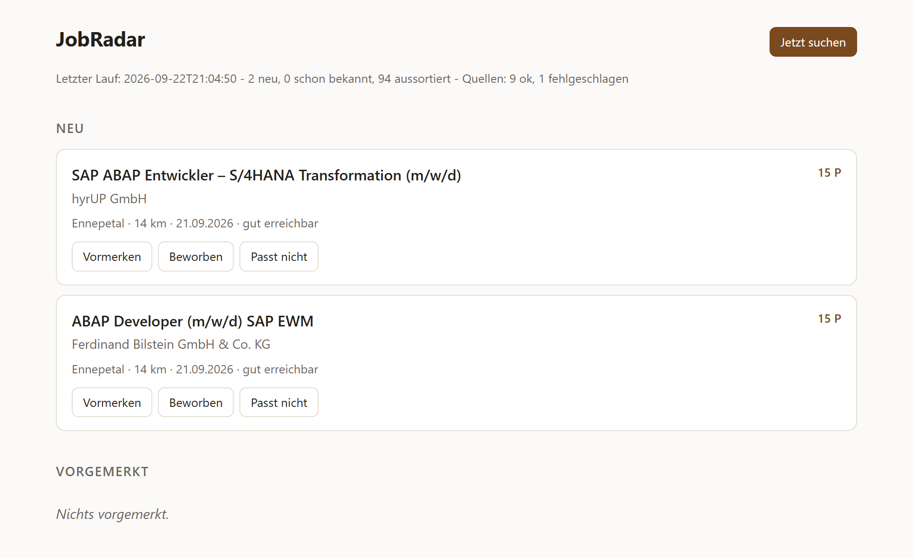

<h1 align="center">JobRadar</h1>

<p align="center">
  Sucht selbstständig nach Einstiegsstellen in der Anwendungsentwicklung im
  Bergischen Land — und meldet jede Stelle nur ein einziges Mal.
</p>

<p align="center">
  <a href="https://github.com/BeWater-PL/JobRadar/actions/workflows/tests.yml"></a>
  
  
  
  <a href="LICENSE"></a>
</p>

<p align="center">
  <picture>
    <source media="(prefers-color-scheme: dark)" srcset="docs/oberflaeche-dunkel.png">
    
  </picture>
</p>

<sub>Die Beispieldaten unter <code>src/test/resources/</code> sind anonymisiert und
enthalten keine echten Ansprechpartner oder Kontaktdaten.</sub>

Gebaut, weil die üblichen Jobportale beim automatischen Abruf sperren, die
Bundesagentur für Arbeit aber eine offene Schnittstelle anbietet — und weil
täglich dieselben zwanzig Anzeigen durchzusehen Lebenszeit kostet.

## Was es tut

- fragt zweimal täglich die Jobsuche-Schnittstelle der Bundesagentur ab
  (13 Suchprofile: Wuppertal plus 15 km Umkreis, dazu zwei Remote-Profile
  deutschlandweit) und neun Karriere-Feeds einzelner Arbeitgeber
- wirft alles raus, was nach Senior, Ausbildung, Werkstudent oder Teamleitung
  klingt — und alles, was kein Entwickler-Wort im Titel hat (Arbeitgeber-Feeds
  bringen sonst Schlosser und Vertrieb mit)
- bewertet den Rest nach Passung: Einsteiger-Signale, Technologien aus dem
  Lebenslauf, Entfernung, Remote-Möglichkeit
- merkt sich jede gesehene Anzeige dauerhaft — **eine Stelle wird nie zweimal
  gemeldet**, auch nicht, wenn der Arbeitgeber sie mit neuer Referenznummer
  erneut einstellt
- zeigt die Treffer in einer kleinen Oberfläche, in der sich jede Anzeige als
  vorgemerkt, beworben oder unpassend markieren lässt

## Technik

Java 21, Spring Boot 3.3, Spring Data JPA, SQLite, Thymeleaf, JUnit 5.
Verpackt mit `jpackage` zu einer Windows-Anwendung mit eingebetteter
Java-Laufzeit — auf dem Zielrechner muss nichts installiert sein.

```
de.bewater.jobradar
├── config      Suchprofile und Filterlisten aus application.yml
├── domain      Stellenanzeige mit Fingerabdruck-Logik, Status
├── quelle      Jobquellen: Arbeitsagentur, neun Arbeitgeber-Feeds, Job-Alert-Postfach
├── filter      Bewertung: passt das für einen Berufseinsteiger?
├── service     Suchlauf, Zeitplan, Dublettenabgleich
├── repo        Spring-Data-Zugriff auf SQLite
└── web         Controller und Oberfläche
```

### Der Kern: der Fingerabdruck

Naheliegend wäre, die Referenznummer der Arbeitsagentur als Schlüssel zu
nehmen. Das funktioniert nicht: dieselbe Stelle wird oft nach ein paar Wochen
mit neuer Nummer neu eingestellt, und genau diese Wiederholungen sollen ja
verschwinden.

Stattdessen wird aus Firma, Titel und Ort ein normalisierter Schlüssel
gebildet. Geschlechterkürzel, Rechtsformen, Umlaute, Sonderzeichen und
Groß-/Kleinschreibung fallen dabei weg:

```
"Junior Java-Entwickler (m/w/d)" bei "Muster GmbH & Co. KG" in Wuppertal
"Junior Java Entwickler (w/m/d)" bei "Muster"              in Wuppertal
        ->  muster|junior java entwickler|wuppertal   (identisch)
```

Aussortierte Anzeigen werden ebenfalls gespeichert. So wird dieselbe
Senior-Stelle nicht jeden Tag erneut bewertet.

Ändern sich die Filterregeln, werden beim nächsten Start alle Anzeigen mit
Status NEU nachbewertet; was durchfällt, wandert auf VERWORFEN. Vorgemerktes,
Beworbenes und Abgelehntes bleibt unangetastet.

## Bauen

Voraussetzung: JDK 21 oder neuer, `JAVA_HOME` gesetzt.

```
build.bat
```

Ergebnis: `dist\JobRadar\JobRadar.exe`. Die Verknüpfung mit Icon legt der Build
selbst auf den Desktop — ein zweiter Klick darauf holt nur die schon
laufende Anwendung nach vorn, statt sie ein zweites Mal zu starten.

Zum Entwickeln ohne Verpacken:

```
mvn spring-boot:run
```

Dann im Browser: http://localhost:8088

## Benutzen

Doppelklick auf die .exe. Die Anwendung sucht sofort, öffnet die Trefferliste
im Browser und bleibt danach im Hintergrund — um 8 und um 17 Uhr sucht sie
erneut. Beenden über den Task-Manager oder das Schließen des Fensters, je nach
Startart.

Datenbank und Protokoll liegen unter `%USERPROFILE%\.jobradar\`.

## Einstellen

Alles Wichtige steht in `src/main/resources/application.yml` und braucht keine
Code-Änderung:

| Einstellung | Bedeutung |
|---|---|
| `jobradar.zeitplan` | Cron-Ausdruck für die Suchläufe |
| `jobradar.max-alter-tage` | wie alt eine Anzeige höchstens sein darf |
| `jobradar.profile` | die Suchprofile (Suchbegriff, Ort, Umkreis, Arbeitszeit) |
| `jobradar.ausschluss-worte` | ein Treffer davon und die Anzeige fliegt raus |
| `jobradar.pflicht-worte` | mindestens eines davon muss im Titel stehen, sonst keine Entwicklerstelle |
| `jobradar.erlaubte-orte` | nur diese Orte; andere fliegen raus, ausser die Stelle ist Remote/Homeoffice |
| `jobradar.einsteiger-worte` | Bonuspunkte |
| `jobradar.technologien` | Bonuspunkte je Treffer |

Nach dem Verpacken liegt die Konfiguration im JAR. Um sie ohne Neubau zu
ändern, eine `application.yml` neben die .exe legen — Spring Boot bevorzugt
die äußere Datei.

## Quellen

Jede Quelle ist eine eigene `Jobquelle`-Bean; der Suchlauf fragt alle
nacheinander ab. Stirbt eine, läuft der Rest trotzdem durch — das Ergebnis
steht dann als „Quellen: 8 ok, 1 fehlgeschlagen“ in der Oberfläche.

| Quelle | Woher | Format |
|---|---|---|
| Arbeitsagentur | Jobsuche-API der Bundesagentur (https://github.com/bundesAPI/jobsuche-api) | JSON, Suchprofile |
| Interamt | Stellenportal des öffentlichen Dienstes, je Partner-ID (Stadt Wuppertal 1714, Gebäudemanagement 2732, Jobcenter 1409) | JSON |
| Wupperverband | karriere.wupperverband.de (d.vinci) | JSON |
| Barmenia Gothaer | SmartRecruiters-API, nur Standorte in Deutschland | JSON, paginiert |
| ~~Riedel Communications~~ | abgeschaltet — seit 09/2026 kein JSON-Feed mehr (Umzug auf ein softgarden-Board ohne Feed) | — |
| Knipex | karriere.knipex.de/jobs.feed.json (softgarden) | JSON, schema.org |
| Schmersal | onlyfy-Jobliste | JSON |
| Erfurt & Sohn | Talention-API (POST) | JSON |
| bilstein group | Guidecom-Proxy, braucht `Accept: application/json` | JSON |
| Aptiv | Workday-CXS-API, POST; Standort-Facet Wuppertal wird je Lauf neu gelesen | JSON, paginiert |
| codecentric | Personio-XML-Feed, Standort Solingen | XML |
| Job-Alert | eigenes IMAP-Postfach: Alert-Mails von Indeed, StepStone, kimeta, meinestadt | E-Mail (HTML) |

Endpunkte, Header und Partner-IDs stehen unter `jobradar.quellen` in
`application.yml`. Eine Quelle abschalten:

```
jobradar:
  quellen:
    schmersal:
      aktiv: false
```

Hintergrund zur Auswahl (was geprüft wurde, was nicht funktioniert) steht in
`JobRadar_Feed-Recherche.md`. Sitemap- und reine HTML-Quellen wurden bewusst
nicht angebunden — die brechen bei jedem Relaunch.

### Job-Alert-Mails

Indeed, StepStone, kimeta und meinestadt sperren den automatischen Abruf ihrer
Websites — ihre Alert-Mails darf man aber lesen. Dafür in jedem Portal einen
Job-Alert auf ein eigenes IMAP-Postfach einrichten und die Zugangsdaten als
Umgebungsvariablen setzen (einmalig, danach neu anmelden):

```
setx JOBRADAR_MAIL_USER "name@example.com"
setx JOBRADAR_MAIL_PASSWORT "geheim"
setx JOBRADAR_MAIL_HOST "imap.beispielprovider.de"
```

IMAP muss im Webinterface des Mailanbieters freigeschaltet sein. Die Zugangsdaten stehen **nie** in `application.yml`; fehlen
die Variablen, bleibt die Quelle still (eine Zeile im Log sagt das).

Gelesen werden nur ungelesene Mails der vier Absender; danach werden sie als
gelesen markiert. Andere Mails im Postfach bleiben unangetastet. Der Parser
(`JobalertParser`) ist gegen nachgebaute Beispielmails unter
`src/test/resources/mails/` getestet — liefert ein Portal einmal anderes
Layout, eine echte Mail als `.eml` dort ablegen und die Regel des Portals
anpassen.

Indeed und StepStone werden bewusst **nicht** abgefragt. Automatischer Abruf
verstößt dort gegen die Nutzungsbedingungen und wird technisch unterbunden.
Wer deren Anzeigen braucht, richtet dort einen Job-Alert per Mail ein.

## Tests

```
mvn test
```

Abgedeckt sind die Teile, bei denen ein Fehler teuer wäre: die
Fingerabdruck-Normalisierung (erkennt sie Wiederholungen wirklich? trennt sie
echte Unterschiede?), die Filterregeln, das Einlesen jeder Quelle gegen eine
gespeicherte echte Antwort (`src/test/resources/quellen/`) und der Suchlauf
mit einer absichtlich kaputten Quelle.
